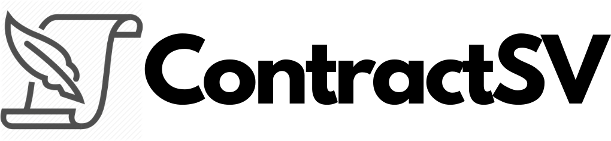

    

## Contract SV

Goals of the hackathon:

* break down historic industry data silos
* make it easier for companies in different industries to interact
* make it easier to operate across geographic boundaries for businesses, organizations, and consumers
* enable consumers to interact, in a single way, with different businesses and organizations concerning their data and transactions
* improve interaction across governments and government agencies

This project focuses on leveraging BitcoinSV to improve trust between human parties around shared documents and contracts.

### Usage

- Upload the document you want to track
- We'll track that document over time using a unique hash generated from the bytes/data of that document when it was uploaded.
- If you upload the same doc multiple times, we'll create a snapshot for each upload and store that hash on BitcoinSV.
- Compare existing documents against previously uploaded ones
- Generate a unique link proving an attached document hasn't been modified. Include that link in email correspondence with your colleagues as proof.

### ContractSV

- Use the bitcoin sv blockchain to validate the proof of a document being uploaded and validated.
- Upload a document and verify it was exactly the same as a previous point in history.

### Future use cases

- Notarization
